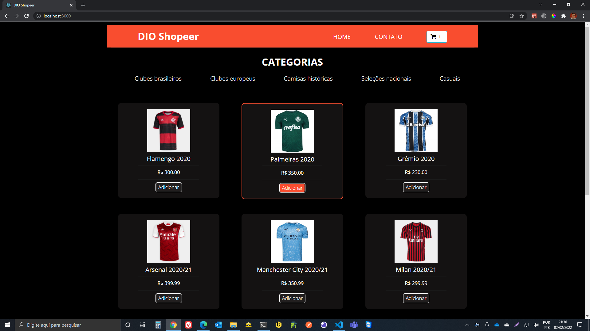
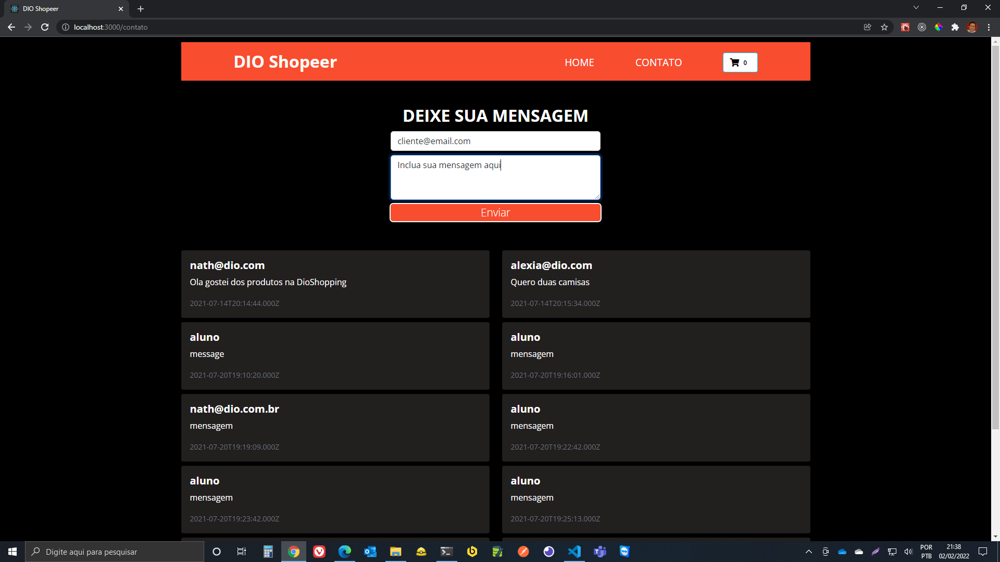

<h1 align="center">
  <a href="https://letmeask-85ab4.firebaseapp.com/">
    <h3>DIO Shopeer</h3>
  </a>
</h1>

### Tela Home

### Tela Contato

  <a href="#-tecnologias">Tecnologias</a>&nbsp;&nbsp;&nbsp;|&nbsp;&nbsp;&nbsp;
  <a href="#-projeto">Projeto</a>&nbsp;&nbsp;&nbsp;|&nbsp;&nbsp;&nbsp;
  <a href="#-layout">Layout</a>&nbsp;&nbsp;&nbsp;|&nbsp;&nbsp;&nbsp;
  <a href="#-como-executar">Como executar</a>&nbsp;&nbsp;&nbsp;|&nbsp;&nbsp;&nbsp;
  <a href="#-licença">Licença</a>

  

 

<!--

  

 -->

### ✨ Tecnologias

Esse projeto foi desenvolvido com as seguintes tecnologias:

- [x] **[React](https://reactjs.org)**
- [x] **[Redux](https://redux.js.org/introduction/getting-started)**
- [x] **[SQLite](https://www.sqlite.org/index.html)**
- [x] **[Node Express](https://expressjs.com/pt-br/)**

### 💻 Projeto

O **[Dio Shopeer](https://github.com/roherool/dioshopeer/)** faz parte do **Bootcamp Inter Frontend** como desafio final do bootcamp, fazendo a integração do **frontend** com o **backend** através da **api-dioshopeer**, deixando o frontend totalmente funcional, carrinho de compras, mensagens e integração com o banco de dados, esse projeto foi idealizado pela **[DIO](https://web.dio.me)** com uma intensa maratona de aprendizado e descoberta de novas tecnologias.

### 🚀 Como instalar na sua máquina

#### Passo 1

- [x] **Backend** repositório aqui: **[API DIO Shopeer](https://github.com/roherool/api-dioshopeer.git)**

1. Clone em sua máquina assim: **C:\workspace> `git clone https://github.com/roherool/api-dioshopeer.git`**
2. Instale as dependências: **C:\workspace\api-dioshopeer> `yarn install`**
3. Iniciar o servidor: **C:\workspace\api-dioshopeer> `yarn dev`**
4. O servidor vai executar na porta: 5000

#### Passo 2

- [x] **Frontend** repositório aqui: **[WEB DIO Shopeer](https://github.com/roherool/web-dioshopeer.git)**

1. Clone em sua máquina assim: **C:\workspace> `git clone https://github.com/roherool/web-dioshopeer.git`**
2. Instale as dependências: **C:\workspace\web-dioshopeer> `yarn install`**
3. Iniciar o frontend: **C:\workspace\web-dioshopeer> `yarn start`**
4. Agora você já pode acessar no seu navegador **[`localhost:3000`](http://localhost:3000)**.

### 📄 Licença

Esse projeto está sob a licença MIT. Veja o arquivo **[LICENSE](license.md)** para mais detalhes.

---

Olá, trabalho com desenvolvimento desde **2012**, e faço parte da comunidade **[Dio](https://web.dio.me)**. Se você gostou e quer aprender a construir aplicativos como este, eu te convido a fazer parte comigo, somos uma comunidade de **devs** apaixonados por tecnologia, tudo que é feito aqui, é pensado no seu crescimento profissional, construído pela comunidade para a comunidade. Estamos em constante aprendizado e evolução, a missão da **[Dio](https://web.dio.me)** é preparar você para o mercado que vai dominar o mundo nos próximos anos, tudo feito com muito carinho. Descubra o seu potencial! .
